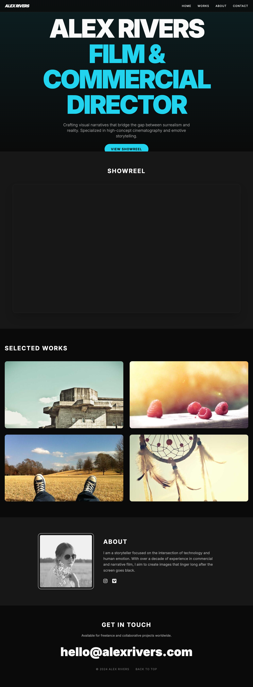

# Director Portfolio Template

A professional and elegant portfolio website template designed for directors and filmmakers to showcase their showreel, selected works, and professional biography.

> **Important**
> 
> This is a dummy project and portfolio website template created specifically 
> to showcase web development skills. It is free and open-source, meaning 
> anyone can use, modify, or deploy this template for their own needs.

## 🚀 Tech Stack

- **Backend:** Python, Flask
- **Frontend:** HTML, CSS (via Flask templates)
- **Dependencies:** `flask`, `flask-cors`

## 📂 Directory Structure

```text
.
├── app.py                # Flask application server and routing logic
├── requirements.txt      # Python dependencies
├── static/               # Static assets (CSS, JS, images)
├── templates/            # HTML templates for the frontend
└── test-artifacts/       # Project screenshots and visual tests
```

## 🛠️ Setup & Installation

### Prerequisites
- Python 3.x installed on your machine.

### Installation
1. **Clone the repository:**
   ```bash
   git clone <repository-url>
   cd director_portfolio
   ```

2. **Create and activate a virtual environment (recommended):**
   ```bash
   python -m venv venv
   source venv/bin/activate  # On Windows use `venv\Scripts\activate`
   ```

3. **Install dependencies:**
   ```bash
   pip install -r requirements.txt
   ```

### Running the Application
To start the development server:
```bash
python app.py
```
The application will be available at `http://localhost:5001`.

## ✨ Features

- **Dynamic Homepage:** A clean, curated landing page featuring the director's identity.
- **Showreel Integration:** Dedicated section to embed and showcase the primary showreel.
- **Works Gallery:** A curated list of projects with titles and descriptions.
- **Professional Bio:** An about section detailing the director's experience and vision.
- **Contact Information:** Easy-to-find contact details for professional inquiries.

## 📸 Screenshots


*Home Page - Main Portfolio View*

## 📜 License

Licensed under MIT — see [LICENSE](LICENSE)

## ✉️ Contact

For more information or inquiries, visit [Harsh Valecha's Portfolio](https://harshvalecha.vercel.app).
